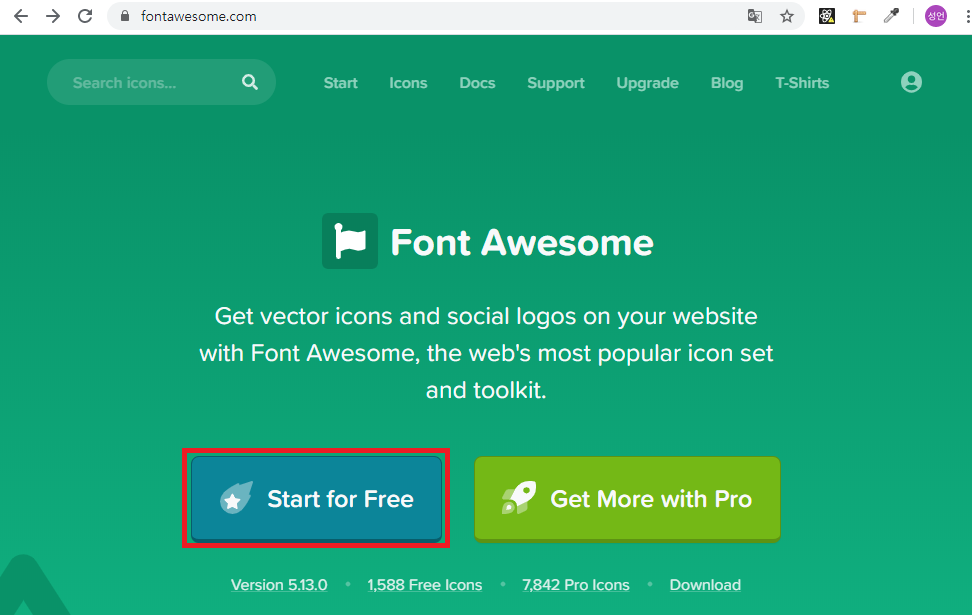
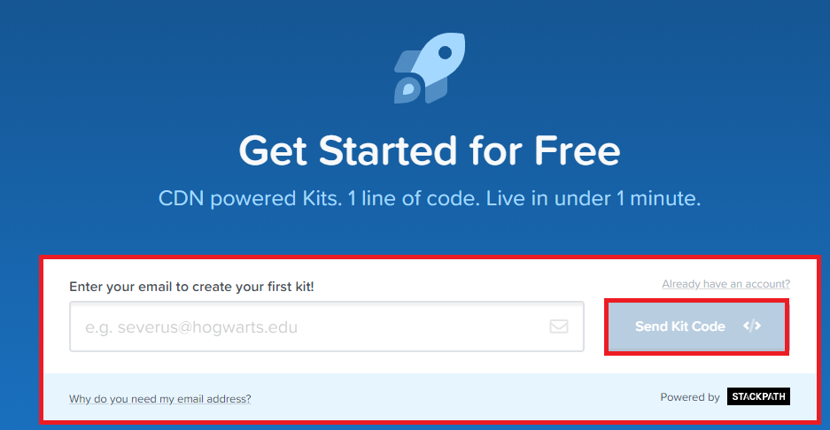
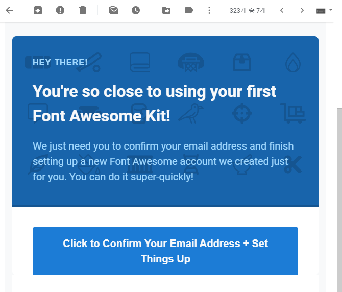
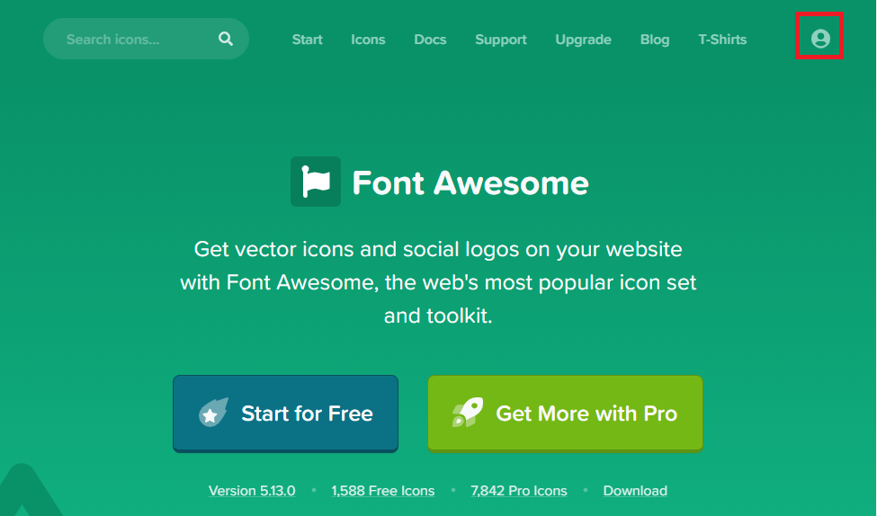
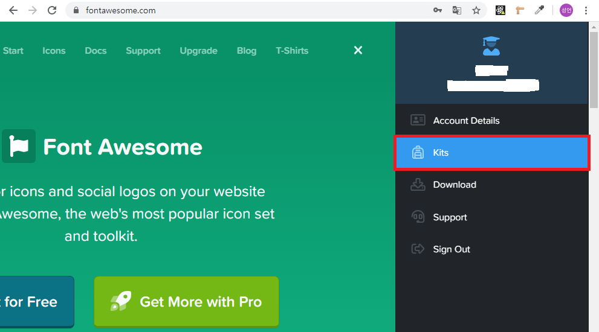
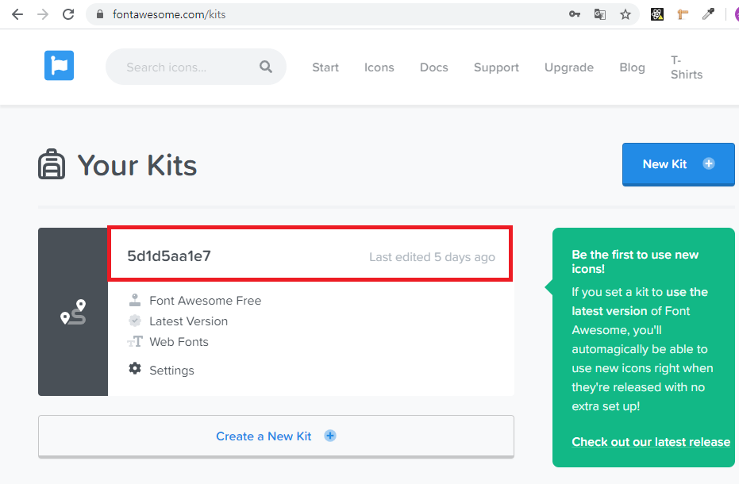
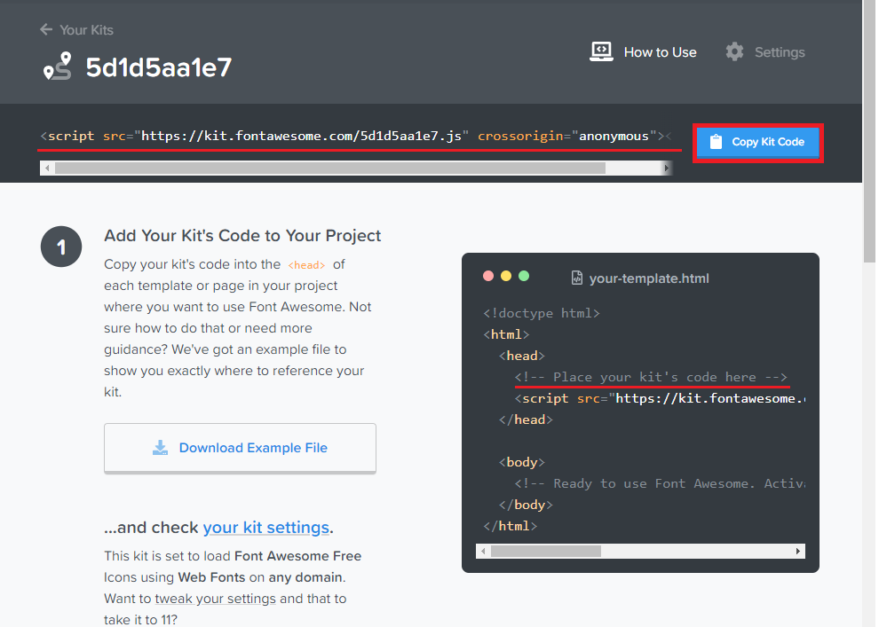
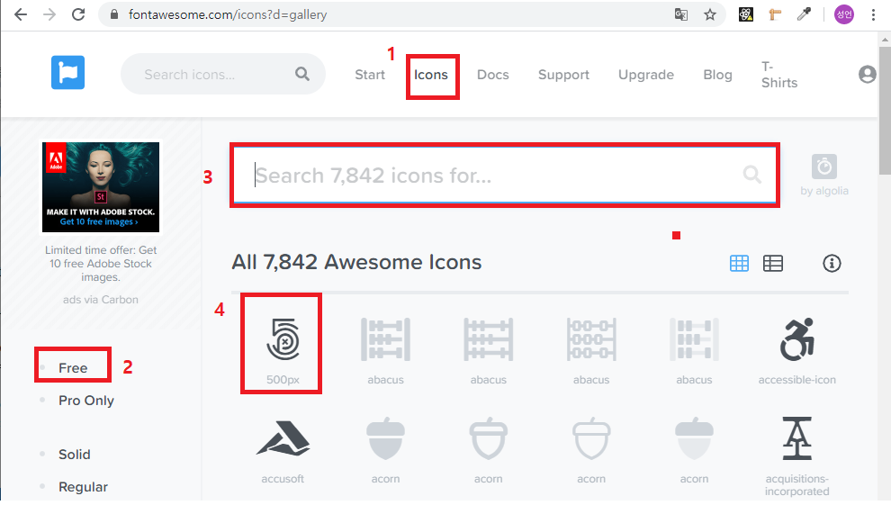
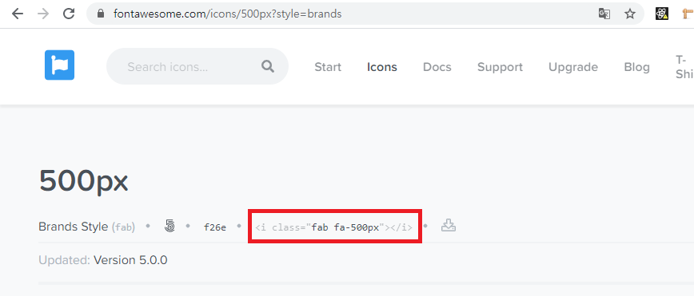

# [CSS] FontAwesome 아이콘 모음 사용방법

[FontAwesome ](https://fontawesome.com/)  

[참고](https://blog.naver.com/tjddjs90/221890932345)

사실 사용 방법은 매우 쉽고 간편하지만, 저 같은 영어 무식자와   
갓 코딩을 시작한 저로선 이거 쓸라고 일 주일을 헤맸습니다 .... ㅠㅠ  

---

  
메인 화면입니다 start for fee 버튼 을 눌러 줍니다.  

  
첫 번째 킷트를 만드려면 이메일을 입력 하라고 하는군요....  
kit ? kit 는 css 파일을 link태그로 불러오듯이 그런 주소를 말해주는 코드 입니다.  

  
입력한 이메일에 FontAwesome 의 메일을 확인 해주고 click 을 눌러 진행 해 줍니다.  

- 전 이미 가입된후라서 이 이후 에는 어떤 설정이 들어가는지 기억이 안나 생략 합니다....-  

  
다시 메인화면으로 돌아오면 우측 맨 끝에 사람 모양의 아이콘이 하나 보입니다. 눌러서 로그인 해주시면 됩니다.  

  
다음 으로 생성한 kit 을 보관하는 kits 탭을 눌러 진행 합니다.  


kit 의 name 부분을 눌러 진행 합니다.  


마지막으로 스타일 시트에 넣을 코드를 복사 해주시고  
script 태그라서 body 안쪽에 붙여 넣기를 해야 하는지 알앗지만...   
우측 밑에 해드 태그 안에 코드를 입력하라고 되어 있습니다.   
head 태그에 본인의 kit을 넣어 줍니다.  


1. 메뉴 상단에 icons 탭을 눌러 진입합니다.
2. 좌측 메뉴 에서 free를 눌러 진행합니다.(전 무료유저 여서 free 사용해 진행합니다.)
3. 검색 창에 본인이 원하는 아이콘을 검색합니다. ex) wifi ...
4. 원하는 모양의 i콘을 찾아 클릭 하여 진입합니다.


`<i class=""></i>` 이 부분을 클릭하면 코드가 자동으로 복사 됩니다.
마지막으로 내 프로젝트 파일로 돌아가 원하는 위치게 붙여 넣기를 하시면 됩니다.

---

## 마지막으로 FontAwesome 조금 더 스마트 하게 쓰기!
fontawesome 에는 작은 규칙이 있습니다.   
첫 번째 i 태그로 시작합니다.   
두 번째 클래스를 보통의 경우 fas 으로 시작합니다.  
세 번째 두번째 클래스명이 검색 하신 아이콘 이름 입니다.  
vscode를 사용 하신다는 가정 하에...

```
i.fas.fas-wifi  // 라고 작성하시게 되면,
<i class="fas fas-wifi"></i>
```
위 와 같이 작성하셔서 굳이 아이콘을 클릭해서 들어가서 코드를 복사하지 않아도 사용할 수 있습니다.
