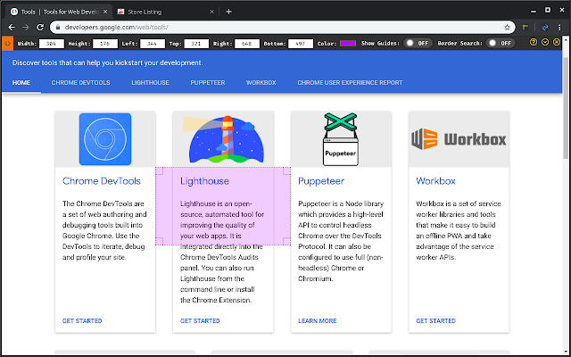
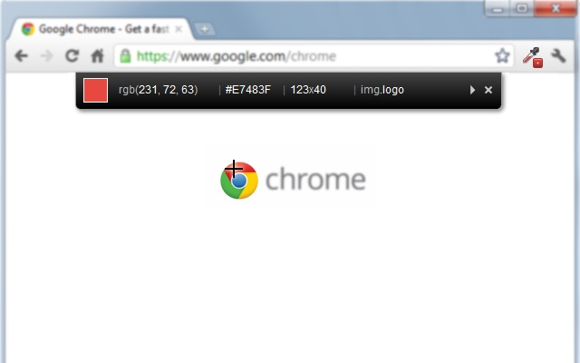
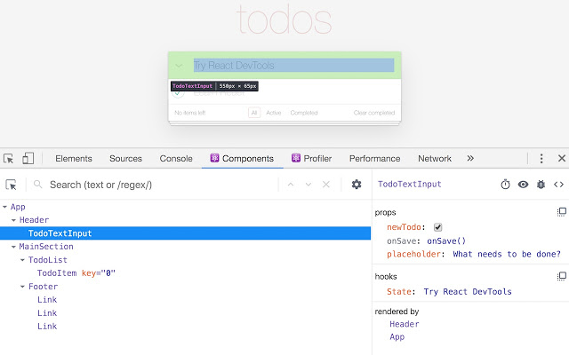
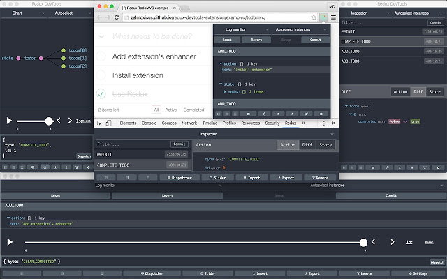
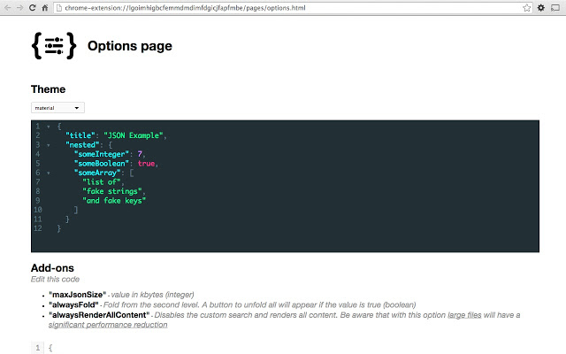

# `[Chrome] Chrome extention 유용한 확장기능 (계속 업데이트 예정)`

[참고](https://blog.naver.com/tjddjs90/221887352747)

## `Page Ruler`

[바로가기](https://chrome.google.com/webstore/detail/page-ruler-redux/giejhjebcalaheckengmchjekofhhmal)

width, height 의 값을 조금더 정확하고 쉽게 설정 할 수 있게 도와 줍니다.

---

## `ColorZilla`

[바로가기](https://chrome.google.com/webstore/detail/colorzilla/bhlhnicpbhignbdhedgjhgdocnmhomnp?hl=en)

요소의 색을 정확히 확인 하여, 조금더 편한 작업 환경을 제공합니다.

---

## `React Developer Tools`

[바로가기](https://chrome.google.com/webstore/detail/react-developer-tools/fmkadmapgofadopljbjfkapdkoienihi?hl=ko)

리액트를 활용하신다면 아주 유용한 툴입니다.

---

## `Redux Developer Tools`

[바로가기](https://chrome.google.com/webstore/detail/redux-devtools/lmhkpmbekcpmknklioeibfkpmmfibljd)

[redux-devtools-extension github](https://github.com/zalmoxisus/redux-devtools-extension)



리덕스를 활용하신다면 아주 유용한 툴입니다.

❗꼭 redux-devtools-extension 라이브러리와 함께 사용 가능합니다.

```
yarn add redux-devtools-extension
```

```
import { createStore } from 'redux';
import { composeWithDevTools } from 'redux-devtools-extension';

const store = createStore(rootReducer, composeWithDevTools());
// 스토어를 생성 할때 두번째 파라미터 인자로 전달합니다.
```

- 밸로퍼트/06. react-Redux/learn-redux 참조

---

## `JSON Viewer`

-[바로가기](https://chrome.google.com/webstore/detail/json-viewer/gbmdgpbipfallnflgajpaliibnhdgobh?hl=ko)

JSON 파일을 보기 편하게 해줍니다.
