# `POSTMAN`

많은 API를 한번에 관리 할수 있는 POSTMAN 을 알아보도록 하겠습니다.

## `공식사이트`

- [POSTMAN](https://www.postman.com/)
- [POSTMAN 다운로드](https://www.postman.com/downloads/)

---

## `사용법`

사용방법은 크게 두가지 입니다.

첫 번째 웹페이지에서 바로 사용

두 번째 다운로드 받아 사용

각자 취향에 맞게 사용하시면 됩니다.

기본적으로 첫번째 방법과 두번째 방법은 아래의 사용법에서 실행할때 즉 아래의 1번 사진만 다르기 때문에 같이 설명하도록 하겠습니다.

> ## 사용법

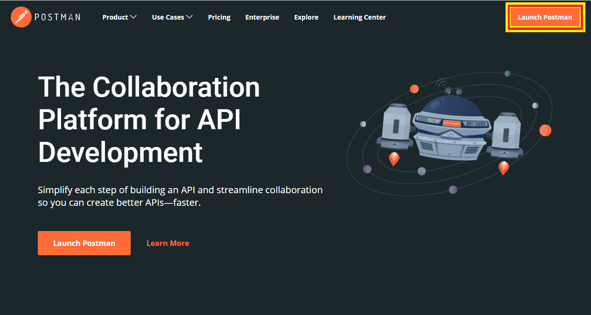  
Launch Postman 을 누릅니다.  
물론 로그인은 하셔야 겠지요???  
PC버전은 설치된 아이콘을 더블클릭 하시면 됩니다.

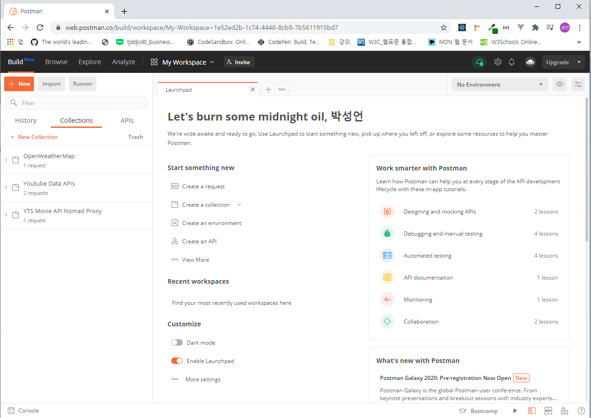  
메인 화면 입니다.

여기서 Collections 란 저장소.. 즉 폴더의 역할을 합니다.

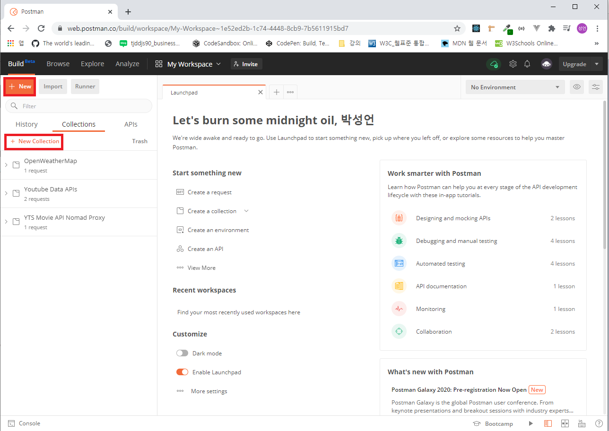

New 또는 NewCollections 로 새로운 Collections 를 생성합니다.

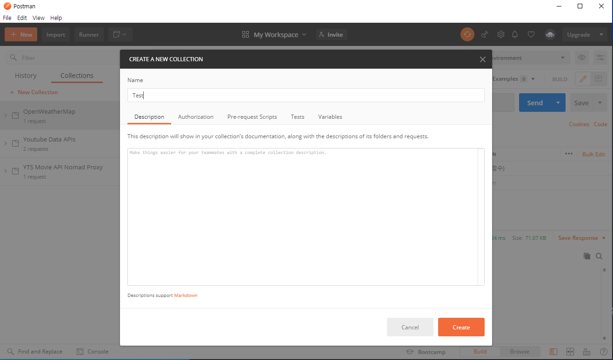
Collections 의 name 을 정해주시고, 필요에 따라 Description을 작성합니다.

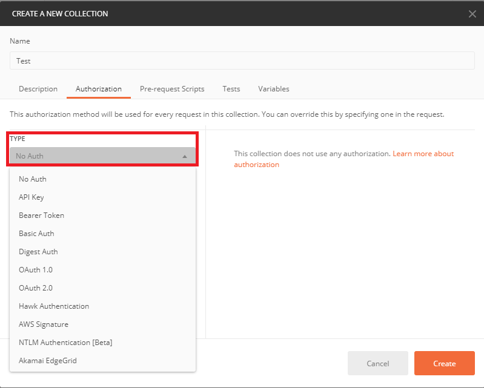  
이용하고자 하는 API의 type을 지정합니다. (귀찮더라고 가독성을 위해 꼭! 작성하시는걸 추천드립니다 :)

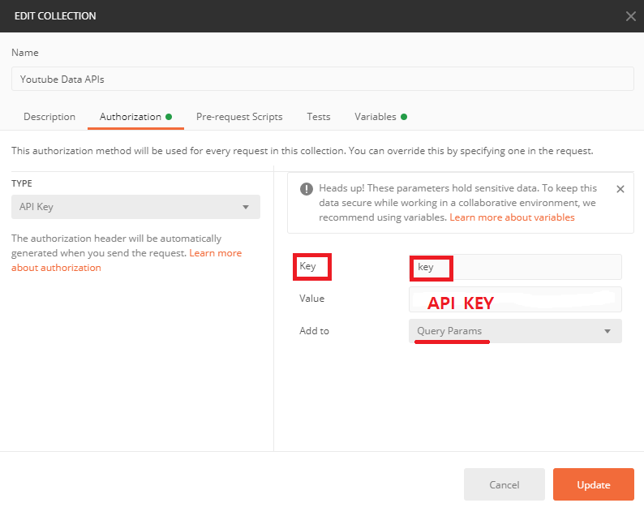
Key 는 API KEY가 맞습니다.  
key 이름은 해당 api에서 요구하는 이름으로 작성합니다.  
예를들어 appid={appid_key}일때, key 의 이름은 appid가 되겠습니다.

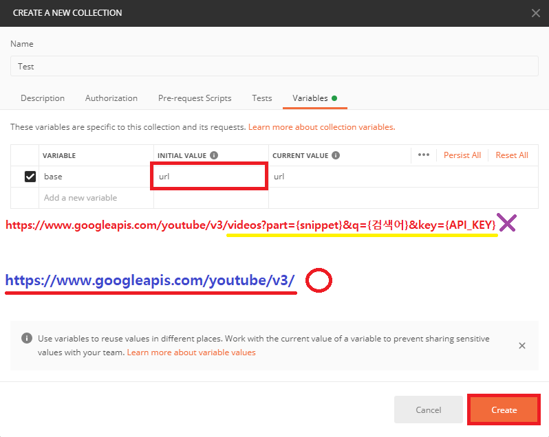
Initial Value 에는 url 을 작성합니다.  
url 작성시 주의사항은 유튜브 API를 이용해 예를 들어 보겠습니다.

먼저 url 재사용성에 초첨을 두고 작성했음을 알려드립니다.

1. https://www.googleapis.com/youtube/v3/videos?part={snippet}&q={검색어}&key={API_KEY}

   1번 방법은 url을 재사용 하지 않을시 모든 옵션과 prams를 입력한 상태입니다.

2. https://www.googleapis.com/youtube/v3/videos

   2번 방법은 videos라는 옵션많을 이용할때 사용 합니다.  
   물론 query string으로 원하는 옵션을 부여합니다.

3. https://www.googleapis.com/youtube/v3/

   가장 좋은 방법으로 가장 재활용성이 뛰어납니다.

   옵션 query string 모두 부여해주어야 한다는 불편함은 있지만,

   재활용성이 극대화 됩니다.

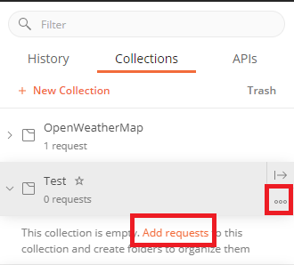  
Collections 에 Test collection이 생성이 되었습니다.  
Collection이 비어있다고 문구가 하나 뜹니다.  
이때 •••을 눌러 request 를 추가 할 수 있고,  
Add request를 클릭하여 추가 할 수 있습니다.  
••• 은 해당 콜렉션을 수정 할 수도 있습니다.

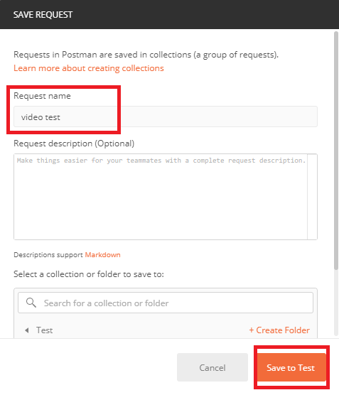  
무슨 request 를 보낼 것인지 이름을 적고 Save to Test 를 눌러 저장합니다.

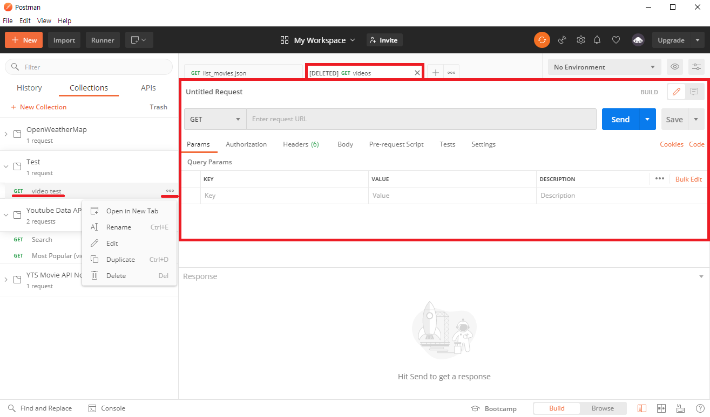
request 가 생성된 초기 모습입니다.

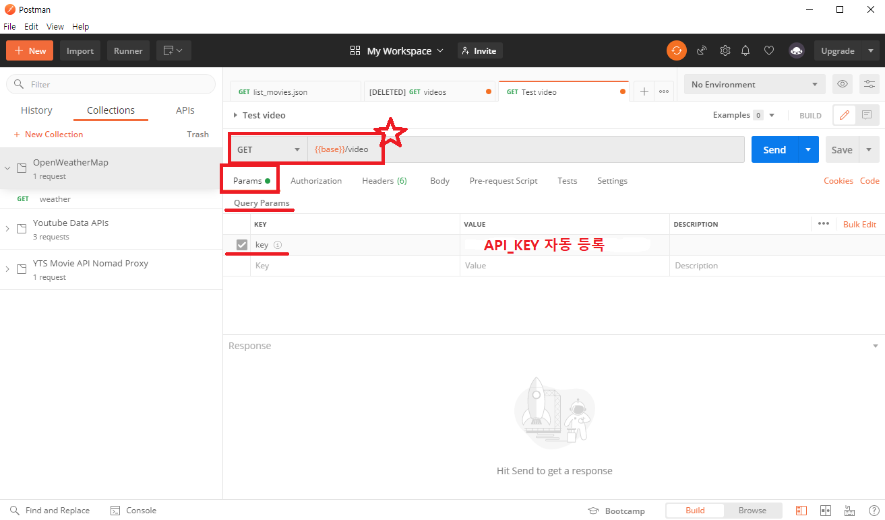  
`{{base}}` => 위의 Collections 를 생성할 때 등록한 url 을 호출합니다.  
`/video` => option 으로서 video 옵션을 사용 하겠다 입니다.  
`key` => 앞서 Collections 를 생성할 때 등록한 API_KEY 가 자동으로 들어갑니다.

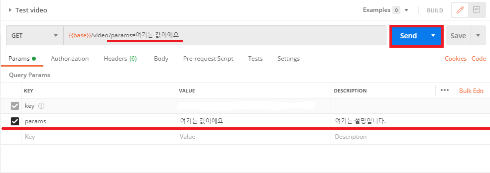
Query Params 에 등록한 parameter 들은
?가 생성되며 그 뒤에 자동적으로 등록 되어 들어가게 됩니다.  
사용하실 모든 parameter을 입력 하고 Send 합니다.

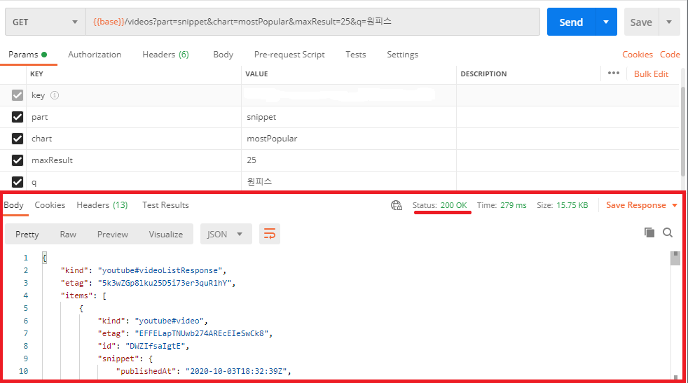  
위 와 같이 response를 보여 줍니다.

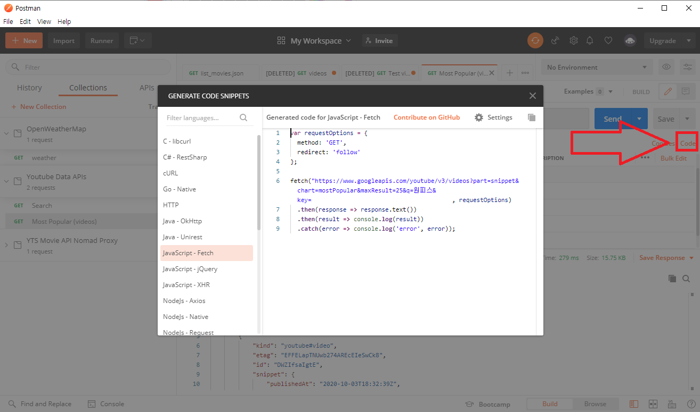  
code 를 클릭하시면 다양한 언어에서의 request 방법이 나오는 아주 유요한 app 입니다.
