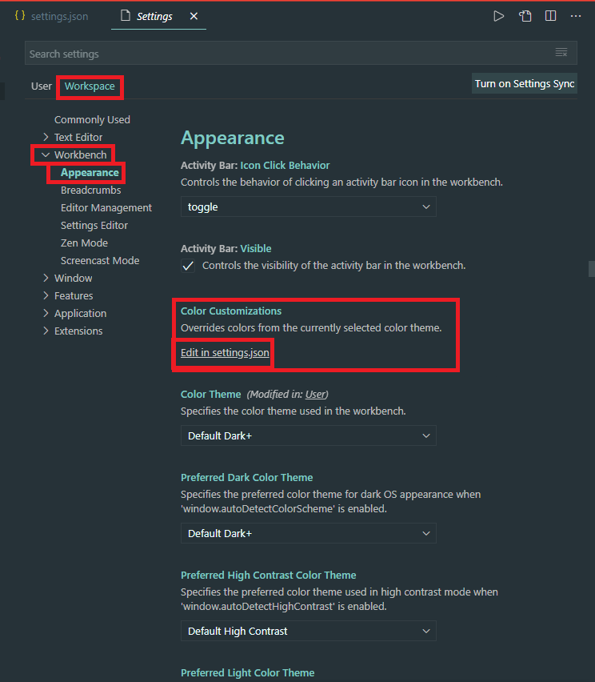
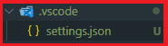
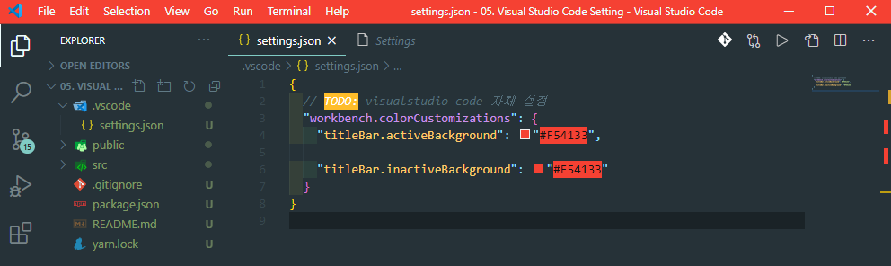

# `[VScode] WorkSpace setting.json - 계속 업데이트 중`

이번엔 워크스페이스 별 커스터 마이징 하는 법을 알아봅시다!



먼저 셋팅으로 오셔서
WorkSpace => Workbench => Appearance 로 들어 오셔서  
Color Customizations 탭의 Edit setting.json 을 눌러 setting.json을 생성합니다.

  
setting.json 이 생성된 모습입니다.  
위 와 같이 생성 되었다면 성공!

  
커스터마이즈 할 해당 옵션을 JSON의 형태로 입력하면 커스터 마이즈 성공!!  
이번 튜토리얼은 vscode의 actionbar 의 색상 변경이 었습니다.

```
{
// TODO: visualstudio code 자체 설정
  "workbench.colorCustomizations": {
    "titleBar.activeBackground": "#F54133",

    "titleBar.inactiveBackground": "#F54133"
 }
```
