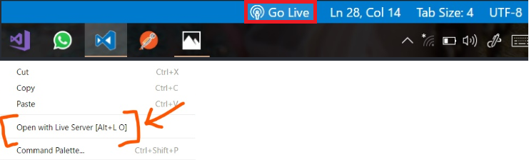
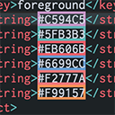
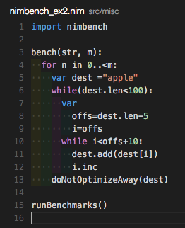

# `[VScode] 유용한 확장기능 설치 (프리티어등 업데이트 예정)`

[참고](https://blog.naver.com/tjddjs90/221876538884)

표시된 버튼을 눌르면, 확장기능을 설치할수 있는 market? 이 등장합니다.

---

### setting tip

Extensition: 마켓플레이스  
에서 확장 프로그램을을 검색후 이름을 복사합니다.  
크롬에서 붙여넣기해서 검색후 페이지 번역을 누르시면 조금더 쾌적한
환경에서 setting을 하 실 수 있습니다.

F1

---

## `Korean Language Pack for Visual Studio Code`

<mark>필수옵션</mark>  
한국어 팩은 지역화된 VS Code용 UI 환경을 제공합니다.

---

## `ESLint`

<mark>필수옵션</mark>

---

## `Prettier - Code formatter`

<mark>필수옵션</mark>  
 File > Perferences > Setting 또는 ctrl + ,  
 를 눌러서 설장창으로 갑니다.  
 설정창에서 Search settings 검색창에  
 `format javascript` 라고 입력하신뒤,  
 JavaScript > Format: Enable  
 의 체크를 해지하여, 기본 포멧터 를 끕니다.  
![[vscode]_확장기능설치_prettier](./img/[vscode]_확장기능설치_prettier.png)
그리고  
format on save 으로 검색하신뒤,  
Editor: Format On Save
에 체크해주시면 저장시 perttier로 자동으로 코드가 정리 됩니다.
![[vscode]_확장기능설치_prettier2](./img/[vscode]_확장기능설치_prettier2.png)

---

## `Korean-translator`

<mark>필수옵션</mark>  
변수, 함수, 클래스 이름이 영어로 생각 안날때 편하게 번역해주는 플러그인입니다.

영어 번역 -> 한글

한글 외 번역 -> 영어

---

## `Git History`

<mark>필수옵션</mark>  

  
어떤 사람이 누가 어떤 커밋 메시지로 지금 보는 코드가 언제 생겨났고 어디가 어떻게 바뀌었는지를 깃허브를 들어가지 않아도 볼 수 있게 해주는 강력한 도구이다.  
참고 : 기록을 볼 파일은 이미 열려 있어야 합니다.

---

## `Live Server`

<mark>필수옵션</mark>  
입력과 동시에 라이브로 작업화면이 표시됩니다.  

---

## `Highlight Matching Tag`

<mark>필수옵션</mark>  
태그의 헷갈림을 방지하는 유용한 확장기능입니다.  

---

## `Bracket Pair Colorizer`

<mark>필수옵션</mark>

괄호 색깔과 괄호에 해당하는 blcok 단위 범위를 색으로 표현해주는 확장 도구 입니다.

---

## `TODO Highlight`

<mark>필수옵션</mark>  
// TODO:

// FIXME:

를 사용하여, 주석에 효과적인 이펙트를 줍니다.

---

## `Color Highlight`

<mark>필수옵션</mark>  
  
코드에 있는 색상 코드에 실제 해당 색상을 표시해줍니다.  
매번 색상 코드를 검색하거나, Photoshop에 입력하지 않아도 됩니다.

---

## `indent-rainbow`

<mark>필수옵션</mark>  
  
들여쓰기 공간에 색을 부여 해줌으로써, 들여쓰기 구분을 편하게 도와줍니다.

---

## `Auto Rename Tag`

<mark>필수옵션</mark>  
  
태그중 앞에만 수정하면 뒤의 닫히는 태그도 자동적으로 수정해줍니다.

---

## `CSS peek`

<mark>필수옵션</mark>  
  
해당 태그의 클래스 에서 ctrl + 우클릭으로 적용된 style이 무엇이며, style sheet 로의 이동 할 수 있게 도와 줍니다.

---

## `HTML CSS Support`

<mark>필수옵션</mark>  
  
작업 중인 디렉토리의 CSS 파일을 미리 로드해서 CSS Class를 자동 완성해주는 확장기능입니다.

매번 CSS 파일을 열어보지 않아도 될 뿐만 아니라, 사소한 오타 때문에 시간을 버리는 일을 방지해줍니다.

---

## `HTML to CSS autocompletion`

<mark>필수옵션</mark>  
  
HTML CSS Support 와는 반대로 css에서 html에 있는 태그를 자동 완성 시켜 줍니다.

---

## `snapshot-tools`

<mark>필수옵션</mark>  
  
프론트 웹 개발자들이 테스트를 위해서 snapshot를 이용한 테스트를 할 때가 있다. 그럴때 snapshot된 텍스트 파일의 텍스트가 HTML 하이라이팅이 되는 유용한 도구이다. 또한, snapshot 메소드가 어떤 부분을 바라보고 있는지를 볼 수 있게 해 준다.

---

## `Code Runner`

<mark>필수옵션</mark>

  

❗❗❗ Node.JS 가 설치 되 어있을시 runtime(?) Extention 입니다.
콘솔 창에 결과물을 출력 할 수 있습니다.

❗❗❗ 설정

extension 에서 해당 앱의 톱니모양 을 누르면,
바로 해당 앱의 설정으로 갈 수있는데,  
Clear Previous Output 을 활성화 시킴으로서,  
전 출력물들은 지워주고 현재 해당 출력 물들만을 출력 할 수 있게 합니다.

extension 설치 후 해당 아이콘이 생성 되는데,  
초기 단축키는 ctrl + alt + n 으로 실행이 가능하며, 저는 이클립스와 같이 ctrl + f11 로 변경한 상태 입니다.

---

## `Beautify`

<mark>prettier 과 같이 사용시 충돌이 일어 난다고 합니다. (둘 중 한가지만 사용해 주세요.)</mark>  
beautify는 코드의 들여쓰기를 정리해주는 확장기능 입니다.  
설치 후에 키 지정이 필요합니다.  
!(Beautify)[./img/[vscode]\_확장기능설치4.png]

윈도우 기준으로 파일 - 기본 설정 - 바로 가기 키 를 실행합니다.

검색어 창에 HookyQR.beautify를 입력한 후 HookyQR.beautify를 클릭하면 단축키를 입력하는 창이 나옵니다.  
ctrl + alt + L 로 설정을 해주면 끝 / 단축키는 원하시는 것으로 하시면 됩니다.

---

## `Rainbow Brackets`

Bracket Pair Colorizer 와는 다르게 괄호색만을 변경하는 확장 도구 입니다.

---

## `Material Theme`

개인취향의 테마 옵션입니다.

vscode의 테마를 변경 합니다.

## F1으로 theme 을 검색하여, 설정을 마무리 해줍니다.

## `vscode-icons`

개인취향의 테마 옵션입니다.
  
폴더 & 아이콘을 직관적으로 볼 수있게 해주는 확장 프로그램
에디터에서 폴더를 볼 때, 그저 같은 모양으로만 되어 있기 보다 이름에 따라서 폴더의 아이콘
모양이 직관적으로 조금씩 바뀌게 된다. 파일 아이콘도 확장자에 따라서 바뀌게 되고, 프로그래머가 직관적으로 어떤 파일인지, 폴더인지 빠르게 파악하게 해 주는 유용한 도구이다.

## F1으로 theme 을 검색하여, 설정을 마무리 해줍니다.

## `Material Icon Theme`

material theme 패키지 설치시 자동으로 설치 됩니다. (굳이 설치 따로 하실 필요 없습니다.)

개인취향의 테마 옵션입니다.

폴더, 파일 등의 아이콘을 예쁘게 해줍니다.

F1으로 theme 을 검색하여, 설정을 마무리 해줍니다.

---
