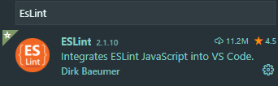

# ESLint

## `설치`



먼저 확장 마켓플레이스에 가서 ESLint 를 설치 합니다.

---

## `커스터마이징`

이제 본격적으로 ESLint 를 사용하기 위하여,

```
npm install
```

위 명령어로 모듈을 설치할 수 있도록 합니다.

모듈이 생성 되면,


.eslintrc 라는 파일을 만들고 사용할 규칙을 install 하고, 규칙을 정할 수 있도록 합니다.

```
yarn add eslint-config-javascript
```

javascript에 관련한 규칙을 설치합니다.

```
yarn add eslint-config-prettier
```

필자는 prettier 가 설치되어있는 관계로 eslint 와 prettier 에서 겹치는 규칙은  
prettier 의 규칙을 따르기 위해 prettier 규칙을 설치합니다.

---

## `설정파일(.eslintrc)`

```
{
  // yarn add eslint-config-javascript
  // yarn add eslint-config-prettier
  "extends": ["javascript", "prettier"],
  "rules": {
    "no-unused-vars": 1
  }
}
```

파일을 작성할땐 기본적으로 JSON 포멧을 사용합니다.

- extends : 설정하고자 설치했던 규칙을 적어 줍니다.(만약 설치된것 이외의 규칙을 적는 다면 eslint가 동작을 안할 수 도 있습니다.)

- rules : extends까지 작성을 해서 js파일로 돌아와 보면, 엄청나게 많은 경고가 보입니다.  
   이때 해당 경고에 마우스를 올리거나, vscode 내의 문제탭에서 경고 메시지의 이름을 확인 할 수 있는데,  
   rules 는 그 메시지들을 끄거나, 또는 강화된 메시지로 보이게 할 수 있습니다.  
  단계 는 0 ~ 2 까지 있으며,  
  0: 규칙을 무시합니다.  
  1: 경고 메시지로 보이게 합니다.(warning)  
  2: 오류 메시지로 보이게 합니다.(error)
