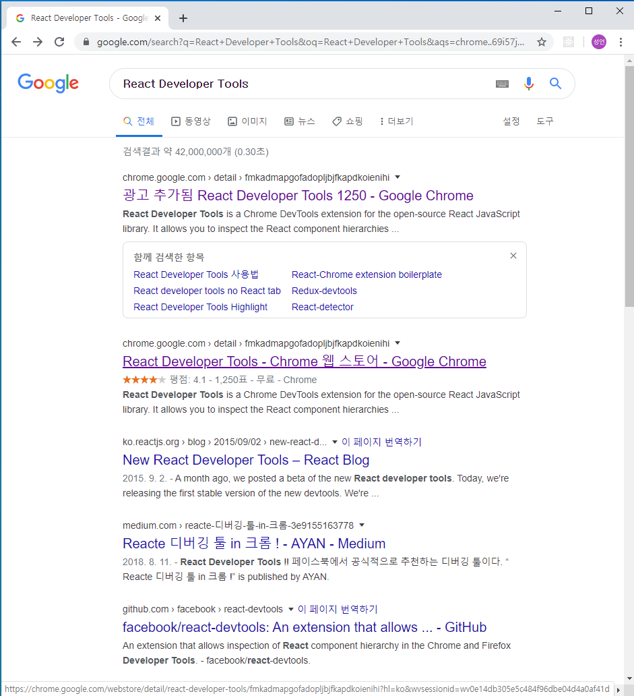
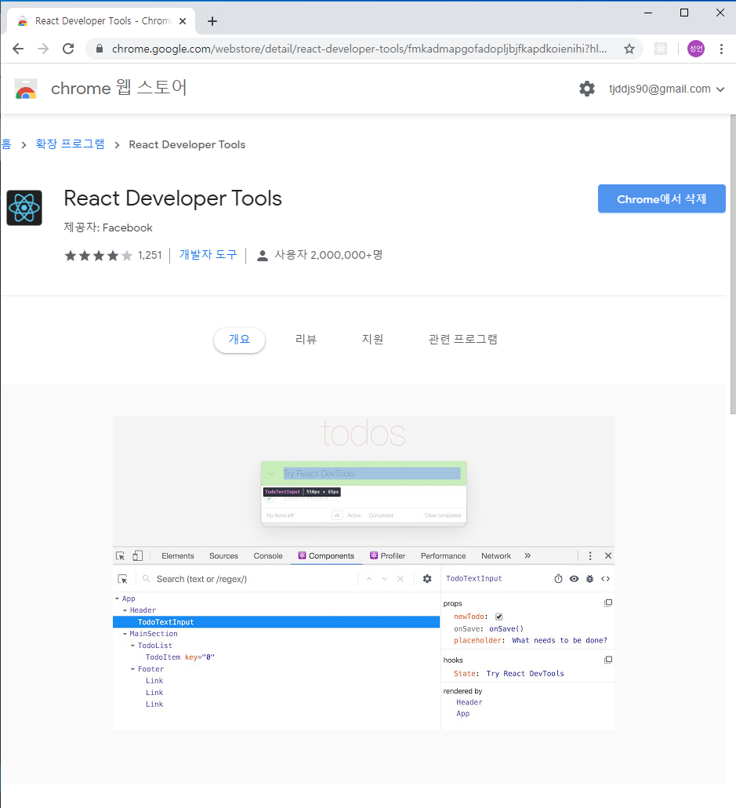
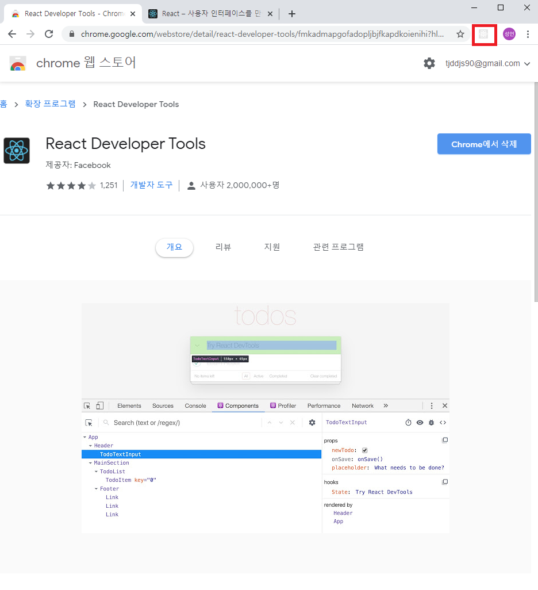
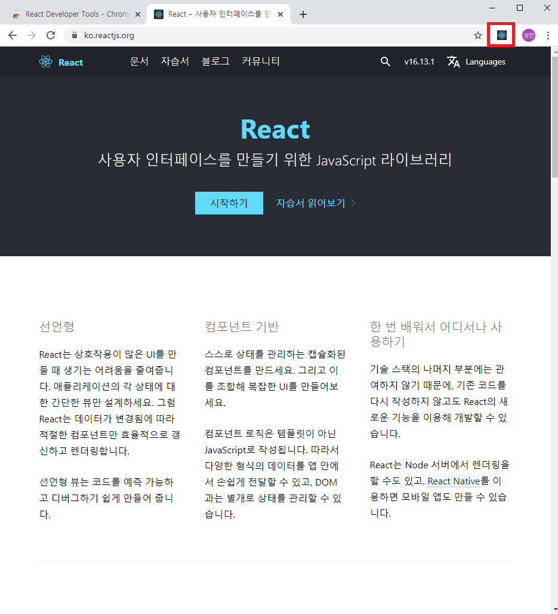
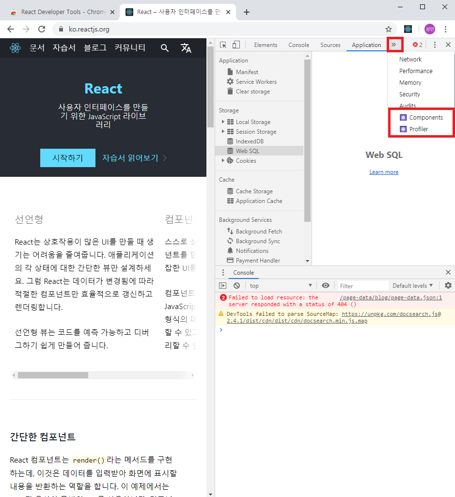

# `React_Developer_Tools 크롬의 확장기능`

react 개발시 유용한 도구(?) React Developer Tools 를 소개 합니다.

[참조](https://blog.naver.com/tjddjs90/221882017749)

## `설치`

React Developer Tools 검색

이미 설치가 되어 있어서, 삭제라고 나오지만  
설치가 안되어 있으신분은 설치 해주시면 됩니다.

---

## `React Developer Tools 사용법`

위 사진은 리액트로 만들어진 페이지가 아니므로, React Developer Tools 사용할수 없는 예시 입니다.

React Developer Tools가 비활성화 되어 있습니다.

React Developer Tools가 활성화 되었다는 것은 리액트로 만들어진 페이지임을 뜻하고,

React Developer Tools를 사용할 환경이 되었다는 뜻입니다.

F12를 누르셔서 개발자 도구를 보시면, 새로운 메뉴가 생성 되어있습니다.

React Developer Tools 를 사용하여 우리는 리액트를 조금더 간편하게 사용 할 수 있습니다.

