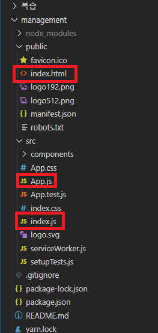
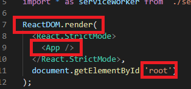
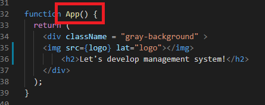
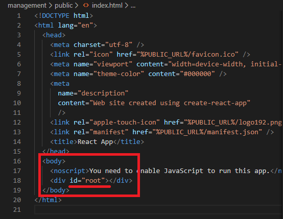

## `[React] create-react-app 구조`

[참고](https://blog.naver.com/tjddjs90/221877614571)

create-react-app 을 만들면 초기 처음과 같은 구성이 되어 있습니다.  
먼저 중점 적으로 3개의 파일을 보도록 하겠습니다.  
index.js  
App.js  
index.html  
순서로 보도록 하겠습니다.  

---

  
위 사진은 index.js파일 내부의 코드 사진입니다. 
 
React DOM 으로 render 를 합니다.   
App이란 컴포넌트를 id 값이 root인 곳에 그려 주도록 명령을 하고 있습니다.  
---

위 사진은 App.js 파일 내부의 코드 사진입니다.  
 
App component 는 App.js 에 있습니다.  
즉 App component 에 작성된 코드가 index.js 의 render로 가게 됩니다.  
우리는 이 App component 안에 그리고자 하는 코드를 작성하면 되겠습니다.  
---

  

위 사진은 index.html 파일 내부의 코드 사진입니다 입니다.  
 
마지막으로, index.html 파일을 살펴보도록 하겠습니다.  
먼저, 모든 주석들은 지워주었음을 알려드립니다.  
 
흔히 볼 수 있는 HTML 파일의 body 태그 안에 div element 의 id 값이 root 입니다.  
결론적으로 App 컴포넌트를 랜더하여, id 가 root인 div 태그 안에 우리의 코드를 그려 넣어주는 작업을 하게 됩니다.  
 
다시한번 설명드리면 app.js 파일을 수정 함으로 써 index.js 에서 app 컴포넌트를 랜더 시켜주고,   
id값이 root인 곳에 그리기로 설정 되어있으며, public 폴더의 index.html 의 body 안의 div 의 id 값이 root 이므로 
index.html 의 body 안에 최종적으로 랜더링 합니다.   