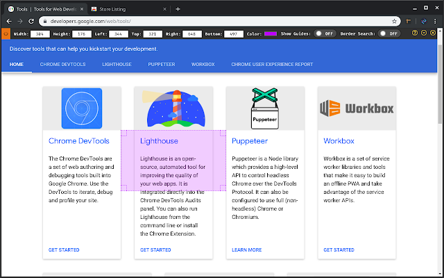
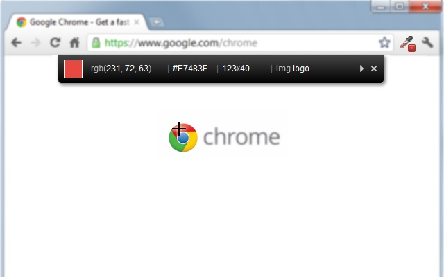
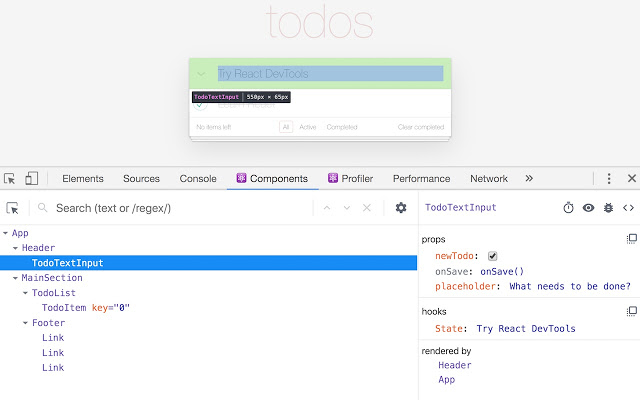
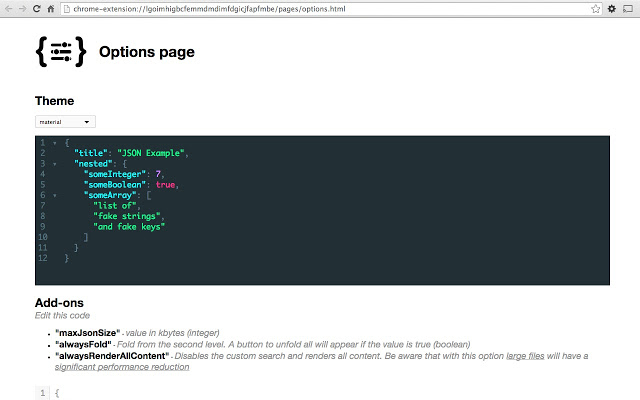

# `[Chrome] Chrome extention 유용한 확장기능 (계속 업데이트 예정)`

[참고](https://blog.naver.com/tjddjs90/221887352747)

## `Page Ruler`

[바로가기](https://chrome.google.com/webstore/detail/page-ruler-redux/giejhjebcalaheckengmchjekofhhmal)

width, height 의 값을 조금더 정확하고 쉽게 설정 할 수 있게 도와 줍니다.

---

## `ColorZilla`

[바로가기](https://chrome.google.com/webstore/detail/colorzilla/bhlhnicpbhignbdhedgjhgdocnmhomnp?hl=en)

요소의 색을 정확히 확인 하여, 조금더 편한 작업 환경을 제공합니다.

---

## `React Developer Tools`

[바로가기](https://chrome.google.com/webstore/detail/react-developer-tools/fmkadmapgofadopljbjfkapdkoienihi?hl=ko)

리액트를 활용하신다면 아주 유용한 툴입니다.

---

## `JSON Viewer`

-[바로가기](https://chrome.google.com/webstore/detail/json-viewer/gbmdgpbipfallnflgajpaliibnhdgobh?hl=ko)

JSON 파일을 보기 편하게 해줍니다.
