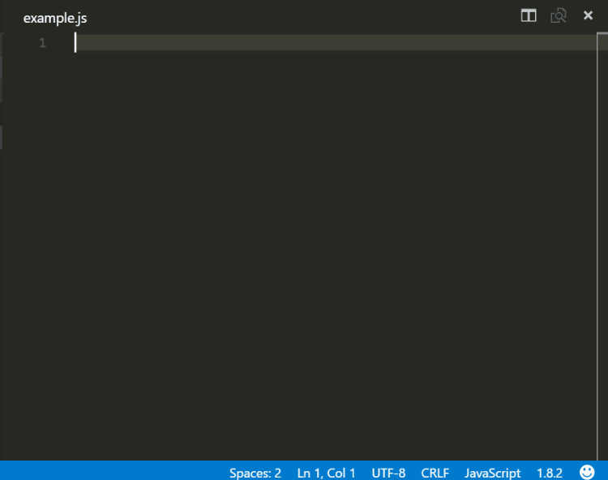

# VScode React 유용한 Extendtion 설치

## 크롬 브라우저 익스텐션

[크롬 브라우저 익스텐션](https://chrome.google.com/webstore/detail/react-developer-tools/fmkadmapgofadopljbjfkapdkoienihi?hl=en)  
크롬브라우저에 설치하게 되면, 크롬브라우저에서 React 개발자 툴을 사용 할 수 있습니다.

---

## Auto Import

리액트의 다른 컴포넌트를 자동으로 import 해줍니다.

---

## Reactjs code snippets

  

간단한 명령어로 리액트의 구조를 자동완성 시켜 줍니다.

   
⭕ 다음은 사용 가능한 모든 스 니펫 및 각 스 니펫의 트리거 목록입니다. ⇥는 TAB 키를 의미합니다.

> | Tigger | Content                                                                                                                   |
> | :----: | :------------------------------------------------------------------------------------------------------------------------ |
> |  rcc→  | 클래스 컴포넌트 (class component skeleton)                                                                                |
> |  rrc→  | react-redux connect가있는 클래스 컴포넌트 ( class component skeleton with react-redux connect )                           |
> | rrdc→  | react-redux 연결 및 디스패치를 ​​사용하는 클래스 구성 ( class component skeleton with react-redux connect and dispatch )  |
> | rccp→  | 클래스 뒤에 prop type 이있는 클래스 컴포넌트 ( class component skeleton with prop types after the class )                 |
> | rcjc→  | 가져 오기 및 기본 내보내기 행이없는 클래스 구성 ( class component skeleton without import and default export lines )      |
> | rcfc→  | 모든 라이프 사이클 메소드를 포함하는 클래스 컴포넌트 ( class component skeleton that contains all the lifecycle methods ) |
> | rwwd→  | import 문이없는 클래스 구성 요소 ( class component without import statements )                                            |
> |  rpc→  | 클래스 뒤에 prop 유형이있는 클래스 순수 컴포넌트 ( class pure component skeleton with prop types after the class )        |
> |  rsc→  | 상태 비 저장 구성 요소 골격 ( stateless component skeleton )                                                              |
> | rscp→  | 소품 유형 스켈레톤이있는 상태 비 저장 구성 요소 ( stateless component with prop types skeleton )                          |
> | rscm→  | 상태 비 저장 구성 요소 골격을 메모 ( memoize stateless component skeleton )                                               |
> | rscpm→ | 소품 유형 스켈레톤으로 상태 비 저장 구성 요소 메모 ( memoize stateless component with prop types skeleton )               |
> |  rsf→  | 상태 비 저장 명명 된 함수 골격 ( stateless named function skeleton )                                                      |
> | rsfp→  | prop 유형 스켈레톤이있는 상태 비 저장 명명 된 함수 ( stateless named function with prop types skeleton )                  |
> |  rsi→  | prop 유형 및 암시 적 반환이있는 상태 비 저장 구성 요소 ( stateless component with prop types and implicit return )        |
> |  fcc→  | 흐름 유형 뼈대가있는 클래스 구성 요소 ( class component with flow types skeleton )                                        |
> |  fsf→  | 흐름 유형 뼈대가있는 상태 비 저장 명명 된 함수 뼈대 ( stateless named function skeleton with flow types skeleton )        |
> |  fsc→  | 흐름 유형 뼈대가있는 상태 비 저장 구성 요소 ( stateless component with flow types skeleton )                              |
> |  rpt→  | 빈 propTypes 선언 ( empty propTypes declaration )                                                                         |
> |  rdp→  | 빈 defaultProps 선언 ( empty defaultProps declaration )                                                                   |
> |  con→  | 소품이있는 클래스 기본 생성자 ( class default constructor with props )                                                    |
> | conc→  | 소품과 컨텍스트가있는 클래스 기본 생성자 ( class default constructor with props and context )                             |
> |  est→  | 빈 상태 객체 ( empty state object)                                                                                        |
> |  cwm→  | componentWillMount 메서드 ( componentWillMount method )                                                                   |
> |  cdm→  | componentDidMount 메서드 ( componentDidMount method )                                                                     |
> |  cwr→  | componentWillReceiveProps 메서드 ( componentWillReceiveProps method )                                                     |
> |  scu→  | shouldComponentUpdate 메서드 ( shouldComponentUpdate method )                                                             |
> | cwup→  | componentWillUpdate 메서드 ( componentWillUpdate method )                                                                 |
> | cdup→  | componentDidUpdate 메서드 ( componentDidUpdate method )                                                                   |
> | cwun→  | componentWillUnmount 메서드 ( componentWillUnmount method )                                                               |
> | gsbu→  | getSnapshotBeforeUpdate 메서드 ( getSnapshotBeforeUpdate method )                                                         |
> | gdsfp→ | 정적 getDerivedStateFromProps 메서드 ( static getDerivedStateFromProps method )                                           |
> |  cdc→  | componentDidCatch 메서드 ( componentDidCatch method )                                                                     |
> |  ren→  | 렌더링 메서드 ( render method )                                                                                           |
> |  sst→  | 매개 변수로 오브젝트가있는 this.setState ( this.setState with object as parameter )                                       |
> |  ssf→  | 매개 변수로 함수가있는 this.setState ( this.setState with function as parameter )                                         |
> | props→ | this.props                                                                                                                |
> | state→ | this.state                                                                                                                |
> |  bnd→  | this of 메서드를 생성자 내부에 바인딩합니다. ( binds the this of method inside the constructor )                          |
> | disp→  | MapDispatchToProps redux 함수 ( MapDispatchToProps redux function )                                                       |

   
⭕ 다음 표는 prop type에 사용할 수있는 모든 snipet을 나열합니다. 소품 유형과 관련된 모든 snipet은 pt로 시작하므로 모두 쉽게 그룹화하고 사용 가능한 모든 옵션을 탐색 할 수 있습니다. 또한 각 prop 유형 snipet은이 속성도 필수라고 선언해야 할 때 하나의 등가물을 갖습니다.

예를 들어 pta는 PropTypes.array를 생성하고 ptar는 PropTypes.array.isRequired를 생성합니다.

> | Tigger  | Content                                                                            |
> | :-----: | :--------------------------------------------------------------------------------- |
> |  pta→   | PropTypes.array,                                                                   |
> |  ptar→  | PropTypes.array.isRequired,                                                        |
> |  ptb→   | PropTypes.bool,                                                                    |
> |  ptbr→  | PropTypes.bool.isRequired,                                                         |
> |  ptf→   | PropTypes.func,                                                                    |
> |  ptfr→  | PropTypes.func.isRequired,                                                         |
> |  ptn→   | PropTypes.number,                                                                  |
> |  ptnr→  | PropTypes.number.isRequired,                                                       |
> |  ptnr→  | PropTypes.number.isRequired,                                                       |
> |  pto→   | PropTypes.object,                                                                  |
> |  ptor→  | PropTypes.object.isRequired,                                                       |
> |  pts→   | PropTypes.string,                                                                  |
> |  ptsr→  | PropTypes.string.isRequired,                                                       |
> |  ptsm→  | PropTypes.symbol,                                                                  |
> | ptsmr→  | PropTypes.symbol.isRequired,                                                       |
> |  ptan→  | PropTypes.any,                                                                     |
> | ptanr→  | PropTypes.any.isRequired,                                                          |
> |  ptnd→  | PropTypes.node,                                                                    |
> | ptndr→  | PropTypes.node.isRequired,                                                         |
> |  ptel→  | PropTypes.element,                                                                 |
> | ptelr→  | PropTypes.element.isRequired,                                                      |
> |  pti→   | PropTypes.instanceOf(ClassName),                                                   |
> |  ptir→  | PropTypes.instanceOf(ClassName).isRequired,                                        |
> |  pte→   | PropTypes.oneOf(['News', 'Photos']),                                               |
> |  pter→  | PropTypes.oneOf(['News', 'Photos']).isRequired,                                    |
> |  ptet→  | PropTypes.oneOfType([PropTypes.string, PropTypes.number]),                         |
> | ptetr→  | PropTypes.oneOfType([PropTypes.string, PropTypes.number]).isRequired,              |
> |  ptao→  | PropTypes.arrayOf(PropTypes.number),                                               |
> | ptaor→  | PropTypes.arrayOf(PropTypes.number).isRequired,                                    |
> |  ptoo→  | PropTypes.objectOf(PropTypes.number),                                              |
> | ptoor→  | PropTypes.objectOf(PropTypes.number).isRequired,                                   |
> | ptoos→  | PropTypes.objectOf(PropTypes.shape()),                                             |
> | ptoosr→ | PropTypes.objectOf(PropTypes.shape()).isRequired,                                  |
> |  ptsh→  | PropTypes.shape({color: PropTypes.string, fontSize: PropTypes.number}),            |
> | ptshr→  | PropTypes.shape({color: PropTypes.string, fontSize: PropTypes.number}).isRequired, |
