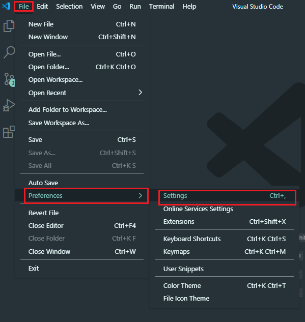
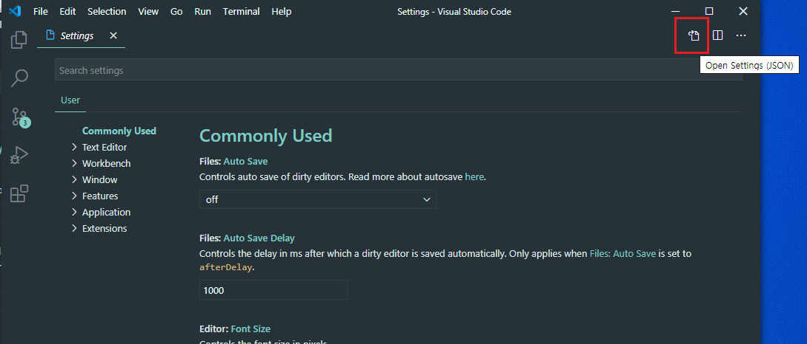
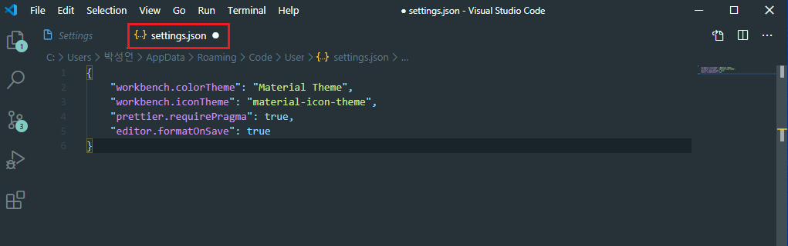
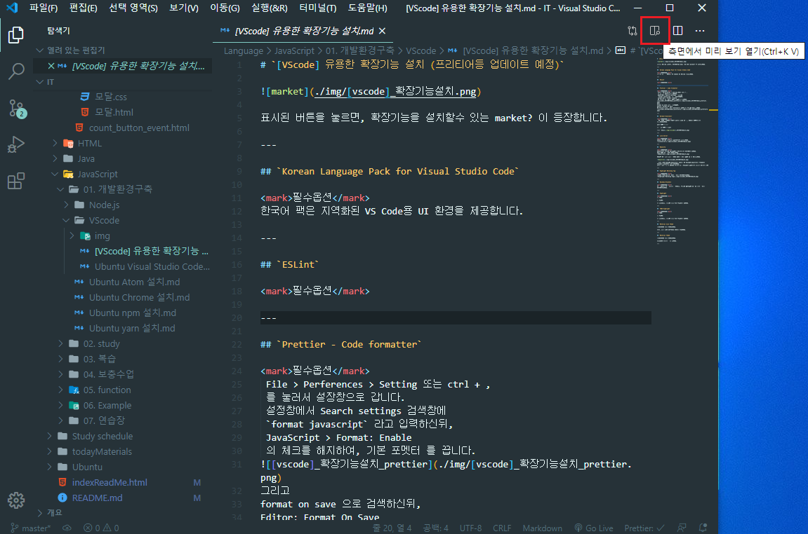
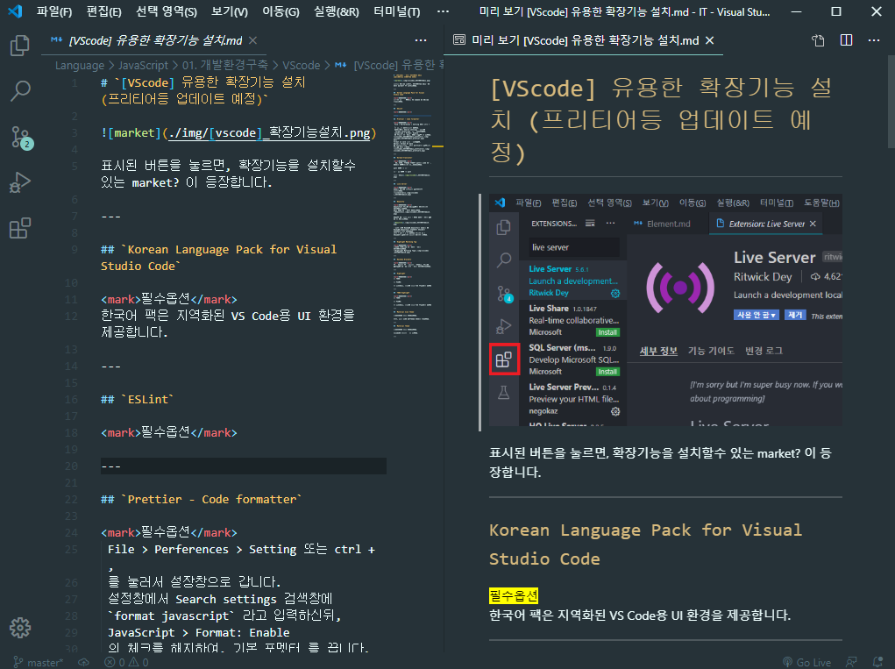

# `[VScode] setting.josn 열기 + md 파일 미리보기 기능`

[참고](https://blog.naver.com/tjddjs90/221882238551)

setting.json 은 어디에 있을까... ?

유튜브에 업로드 된 동영상들이 다 오래된 동영상이라, setting.json 파일 을 설렁설렁 찾다보니 한달이 걸렷네요...

File => Preferences => Setting 순으로 입장합니다.

귀퉁이가 접힌듯 한(?) 문서모양을 클릭해 줍니다.

setting.json 파일입니다.

앞으로... Eslint 설정도 해야 되고 해서.. 미리 알아봅니다. ^ㅡ^

---

- bonus

md 파일의 미리보기 기능이 vscode에 내장 되어 있는걸 아시나요 ?

문서에 돋보기 모양(?) 비슷하게 생긴 아이콘을 클릭해 줍니다.

짜잔 신기 하지 않나요 ^ㅡ^ ?
