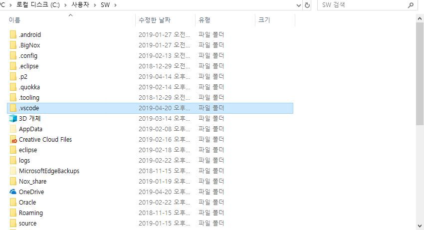
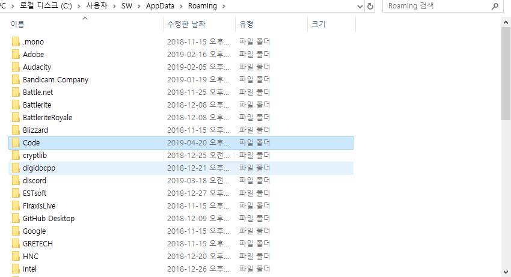

# `[VScode] vscode extension 및 클린제거 (Ubuntu, Window)`

[참고](https://blog.naver.com/tjddjs90/221882222014)

## `Ubuntu`

우분투에서 vscode 제거시 extendsion 즉 확장 기능이 모조리(?) 살아 계신걸 볼 수 있습니다. 이때 해결 방안을 제시 합니다.

① vscode 를 삭제합니다.

​

② home 디렉토리에 숨김파일 되어있는 .vscode를 제거합니다.

​

③ 재설치 를 진행 합니다.

​

※혹시라도 이방법이 되지 않으시다면 다시 1번으로 돌아가 진행해 주시다가

​

2 번 다음 으로 home 디렉토리에 숨김파일 되어있는 .config 에서 code 폴더 까지 삭제 해주시면 되겠습니다.

---

## `Window`

① c\사용자(혹은 user)\Administrator(혹은 사용자 이름)\.vscode 폴더 삭제

② c\사용자(혹은 user)\Administrator(혹은 사용자 이름)\AppData\Roaming\code 폴더 삭제

③ 제어판 – 프로그램 추가/제거 – visual studio code 삭제

④ vs code 재설치
