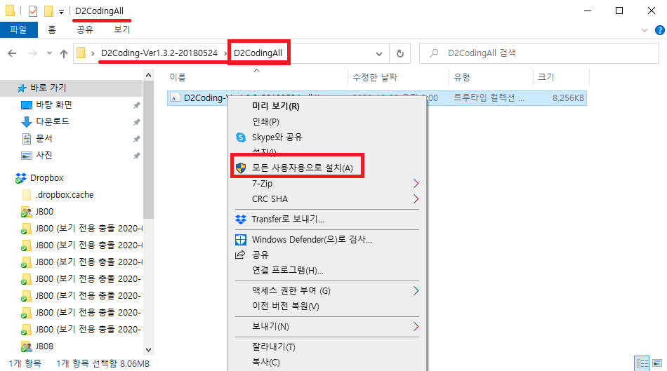
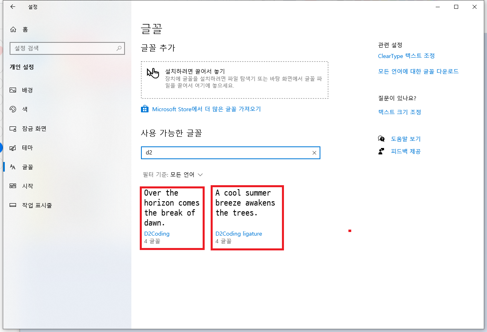
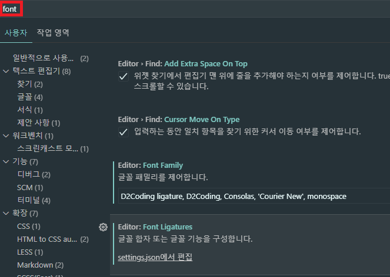
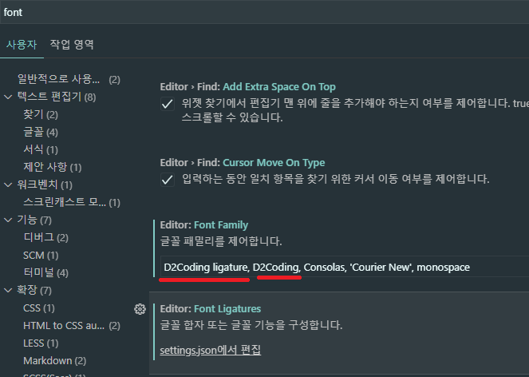
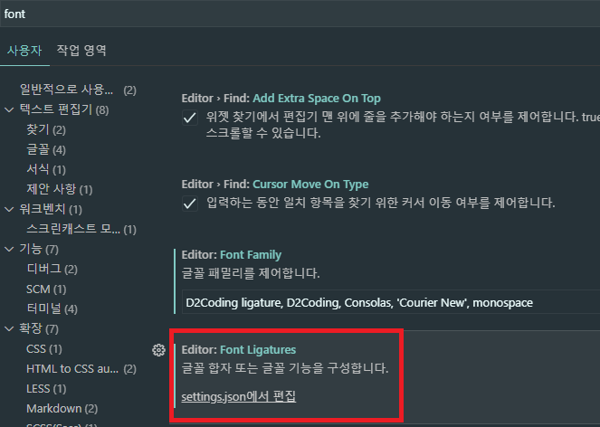
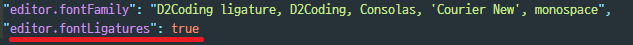

# D2Coding 글꼴변경

[D2Conding 다운로드](https://github.com/naver/d2codingfont)  
위 github에서 다운로드 받아 압축을 풀수 있도록 합니다.

  
모든글꼴을 설치 할 것이기때문에, All 폴더를 와 해당 폰트를 설치할 수 있도록합니다.

  
폰트가 설치 되었다면 폰트의 이름과 설치 확인 !

  
Editor 내의 설정에서 font 검색

  
Font Family 에 위에서 확인한 글꼴을 입력 합니다.  
필자의 경우엔 D2Coding ligature가 없을시, D2Coding 스타일을 적용 시킬 것 이므로,  
전체 설치후 두 폰트 명을 다 입력했습니다.  
해당 폰트는 앞에서 부터 차례대로 적용됩니다.

  
Font Ligatures 란 ?  
== != >= <= 이러한 연산자 를 개발자의 편의성에 맞춰 바꿔주는 옵션이고,  
뜻풀이 그대로를 해석한다면 합자이며,  
합자란 둘 이상의 글자를 합하여 한 글자를 만드는 것. 또는, 그 글자.


위 사진에서 settings.json에서 편집을 하게되면,

```
  // TODO: 글꼴및 합자를 관리하는 셋팅
  "editor.fontFamily": "D2Coding ligature, D2Coding, Consolas, 'Courier New', monospace",
  "editor.fontLigatures": true
```

editor.fontLigatures 의 초기상태 false 를 true로 설정을 변경하여 저장합니다.
