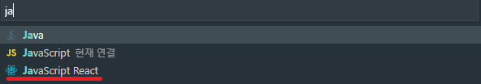

# Snippet (코드조각)

: 자주사용되는 코드에 대하여 단축어를 만들어 코드를 빠르게 생성 할 수 있습니다.

---

먼저 자주 생성 사용 하는 코드를 작성합니다.

```
import React from 'react';

// TM_FILENAME_BASE : 이렇게 설정을 하게 되면...
// VScode 에서 나중에 파일이름에서 확장자를 제외한 이름을 추출하여
// ${TM_FILENAME_BASE} 에 넣어 줍니다.

// ${2} : 생성과 동시에 focus 줄 수 있습니다.
// 1번이 가장 빨리 focus 되고,
// tab을 누르면 다음 포커스인 2로 커서가 향합니다.

function ${1:${TM_FILENAME_BASE}}() {
  return (
    <div>
        ${2}
    </div>
  );
}

export default ${1:${TM_FILENAME_BASE}};
```

\${TM_FILENAME_BASE} 부분을 유의 하여 작성합니다.

[스니펫 코드 생성 URL](https://snippet-generator.app/)  
작성된 코드를 복사하여, 위의 URL에 들어가 붙여 넣기 합니다.

  
위와 같이 진행 합니다.

  
먼저 언어모드가 Javascript React 를 가르키게 하기 위하여,
VS code 하단의 Javascript를 클릭합니다.

  
검색을 통하여 JavaScript React 로 설정 할 수 있도록 합니다.

  
파일이 열릴때마다 JavaScript React 로 열리게 하기 위하여, 전 단계와 같이 한번 더 클릭합니다.

  
이번엔 연결구성을 눌러 주어,

  
파일이 열릴때마다 JavaScript React 로 열리게 연결구성을 해줍니다.

  
이제 우리들의 VScode의 snippet에 등록 해 줄 차례 입니다.  
사진과 같이 파일 > 기본 설정 > 사용자 코드 조각 을 클릭합니다.

  
우리는 React에 대한 snippet 구성이기 때문에 JavaScript React를 클릭합니다.

  
앞서 snippet 사이트에서 복사한 우리들의 코드를 javascriptreact.json에 붙여 넣어 줌으로써, 설정을 마무리 하시고,
예제와 같이 우리는 이제 function component 를 fc만 입력하면, 자동적으로 가져 올 수 있도록 하게 되었습니다.

```
"Create Functional React Component": {
  "prefix": "fc",
  "body": [
    "function ${1:${TM_FILENAME_BASE}}() {",
    "  return (",
    "    <div>",
    "        ${2}",
    "    </div>",
    "  );",
    "}",
    "export default ${1:${TM_FILENAME_BASE}};"
  ],
  "description": "Create Functional React Component"
}
```

---

### Plugin 으로 snippet 설치

  
직접 등록 하지 않아, 단축어의 제약이 있지만, 위와 같은 번거로움을 해결해 줍니다.
