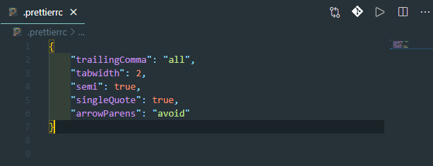
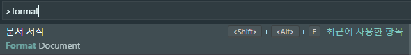
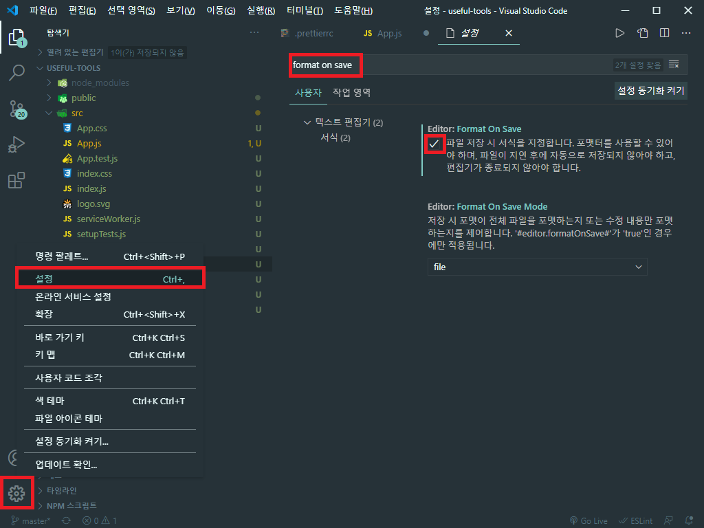

# Prettier

### Plugin 설치

  
먼저 마켓플레이스 에서 prettier 검색후 설치 할수 있도록합니다.

---

  
새문서 만들기를 활용하여  
.prettierrc  
라는 파일을 생성합니다.

---

  
생성뒤 JSON 형식으로 option을 작성 할 수 있도록 합니다.  
더 많은 규칙은 공식페이지의 문서를 참조 합니다.  
[prettier <<](https://prettier.io/docs/en/options.html)

---

  
코드 수동 정리: f1 > format > Document

저장시 코드 자동 정리: 설정 > format on save > check
