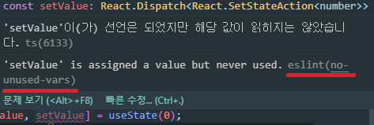

# EsLint 설정 커스터 마이징

### 설치 및 설정

```
yarn add eslint-config-airbnb
```

```
  "eslintConfig": {
    "extends": [
        "react-app",
        "airbnb"
        ]
  },
```

package.json 에서 react-app 을 배열로 바꾼뒤, airbnb를 추가 합니다.

이렇게 하게되면, react-app 의 규칙에 airbnb 규칙까지 추가 하겠다는 의미가 됩니다.

이렇게 하시게 되면, App.js에서 많은 경고메시지가 나옵니다.  
이를 조금 무시하기 위하여 한가지의 config(규칙)을 더 설치 해 줄것 입니다.

```
yarn add eslint-config-prettier
```

이렇게 prettier 을 설치하는 이유는 eslint 에서 관리 하는 규칙중  
몇 가지는 prettier 의 규칙과 겹치기 때문에 겹치는 규칙들을 eslint에서 관리하지 않고, prettier 로 관리하기 위함 입니다.

이제 다시 package.json 에 있는 eslintConfig 설정에 prettier을 추가 합니다.

```
  "eslintConfig": {
    "extends": [
      "react-app",
      "airbnb",
      "prettier"
    ]
  },
```

이제 다시 App.js 로 와서 해당하는 특정 규칙만 끄고 싶다면 경고메시지가 있는 곳에 마우스를 hover 시키면 해당 경고에 대한 이름이 나옵니다.



밑줄친 해당 경고메시지의 이름을 복사하쉰뒤,

```
no-unused-vars
```

package.json 으로 돌아 와서,
rules 라는 객체 형태의 룰을 설정합니다.

```
  "eslintConfig": {
    "extends": [
      "react-app",
      "airbnb",
      "prettier"
    ],
    "rules": {
      "no-unused-vars": 1
    }
  },
```

rules 의 해당 오류메시지의 값이  
0 이면 아무런 메시지를 보여 주지 않고,
1 이면 노란줄이 생기면서 경고만 주어지고,  
2 이면 룰이 없을때와 마찬가지로 빨간줄이 가면서, 경고 메시지가 나옵니다.

최종 커스터 마이징 설정

```
  "eslintConfig": {
    "extends": [
      "react-app",
      "airbnb",
      "prettier"
    ],
    "rules": {
      "no-unused-vars": 1,
      "no-console": 0,
      "react/jsx-filename-extension": 0,
      "react/jsx-one-expression-per-line": 0
    }
  },
```

---

### 특정 파일에서의 EsLint 비활성화

비활성하고자 하는 파일의 맨 위에서 주석으로
eslint-disalble 이라고 작성합니다.

```
/* eslint-disalble */
```
