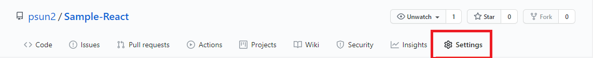
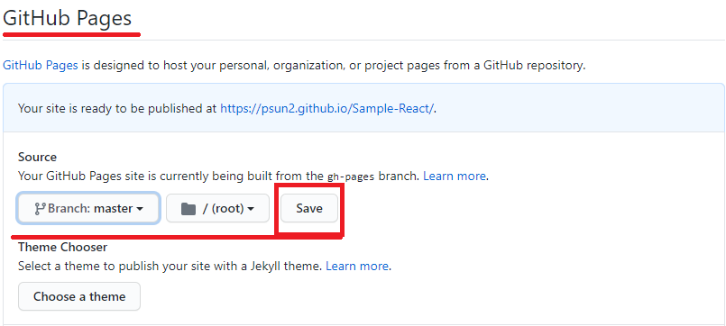
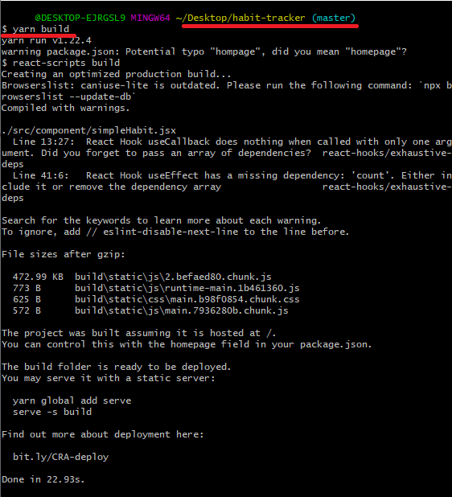
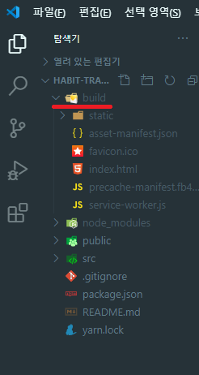
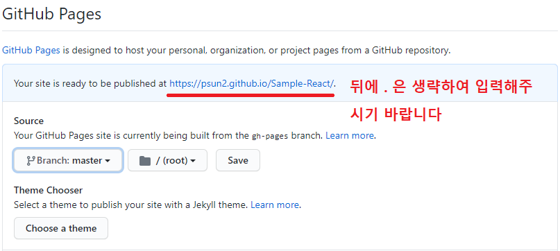
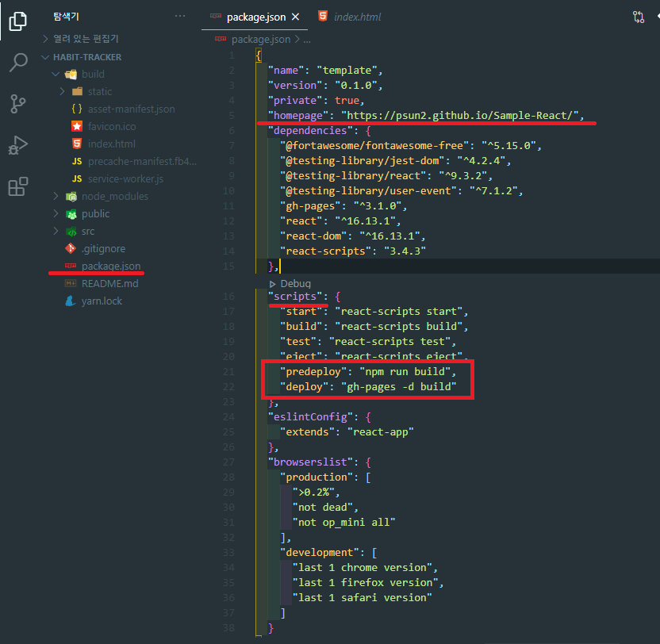
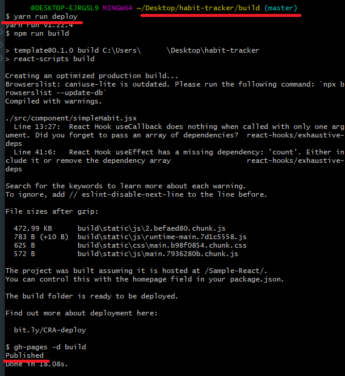
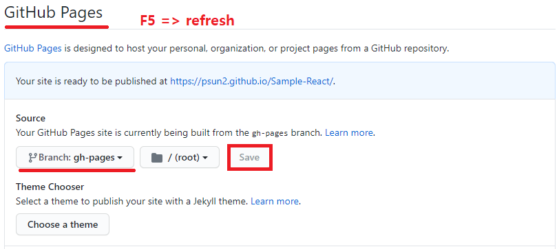

# react-deploy

[공식사이트에서의 deploy 방법](https://create-react-app.dev/docs/deployment#github-pages)

먼저 기본 적으로 github의 레포지토리를 생성 해서 프로젝트와 연결 합니다.

> ## `1`
>
>   
> 깃허브에서 해당프로젝트에 연결된 레포지토리 setting 에 들어갑니다.

> ## `2`
>
>   
> GitHub Pages 탭의 Source 탭에서 root 폴더를 master 로 잡은뒤 세이브 합니다.

> ## `3`
>
> 
>
> ```
> yarn build
> ```
>
> 해당 마스터 브랜치에서 yarn 또는 npm 을 사용하여 빌드합니다.

> ## `4`
>
>   
> build 폴더가 생겼다면 build 성공.!

> ## `5`
>
>   
> GitHub Pages 탭의 해당 URL 주소를 확인해주시기 바랍니다.  
>   
> 현재의 프로젝트릐 pakage.json 설정을 합니다.
>
> ```
>   "homepage": "page URL",
> ```
>
> ```
> "scripts": {
> "start": "react-scripts start",
> "build": "react-scripts build",
> "test": "react-scripts test",
> "eject": "react-scripts eject",
> + "predeploy": "npm run build",
> + "deploy": "gh-pages -d build"
> },
> ```
>
> +표시는 현재의 scripts 오브젝트에 추가할 사항을 의미합니다.

> ## `6`
>
> 
>
> 생성된 build 폴더로 들어간뒤 deploy 진행
>
> ```
> yarn run deploy
> ```
>
> published 가 나오면 deploy 성공!

> ## `7`
>
> 
> 다시 해당 깃허브 에서 GitHub Pages 탭의 Source 탭에서 root 폴더를 gh-pages 로 변경한 뒤 세이브 합니다.  
> gh-pages 가 안보이신다면 새로고침을 한번 진행합니다.

> ## `8`
>
>   
> 마지막으로 해당 URL 로 접속하시면 deploy 성공!!!!
