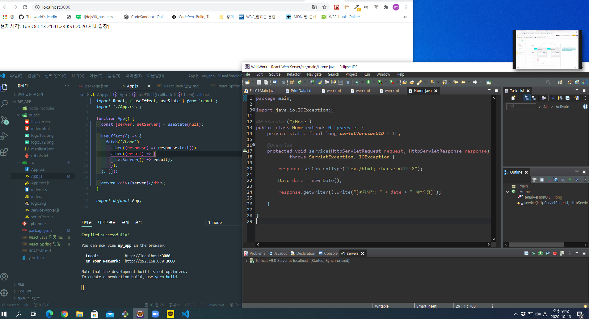

# React_Tomcat 연동

: 글을 작성함에 따라 아직은 tomcat 과 연동하여 tomcat 상에서 react를 시작 할 수 있는 방법을 숙지 하지 못하여 react 와 server 의 개발 서버를 두군데서 시작 해 주어야 합니다.

## react의 pakage.json 설정

```
"proxy": "http://localhost:8080/contextPath",
```

3000포트를 가지고 있는 React 와 8080포트를 가지고 있는 tomcat과의  
교차 출처 리소스 공유(Cross-Origin Resource Sharing, CORS)  
Error 를 해결하기 위해 proxy 설정을 합니다.  
tomcat의 개발 서버인 8080포트를 proxy 해 주어야합니다.  
포트뿐만 아니라 물리적인 경로의 contextPath가 아닌  
URL의 contextPath까지 작성하여 설정 해주어야 합니다.

해당 URL 에 맞게 통신해주면 끝! 입니다.  

