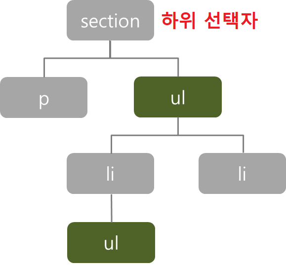
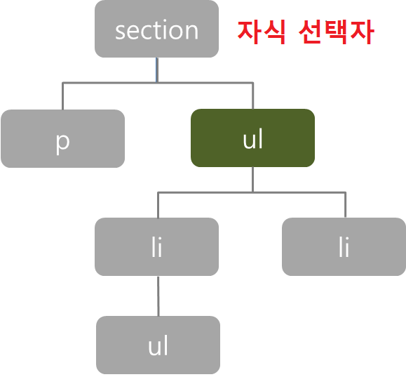
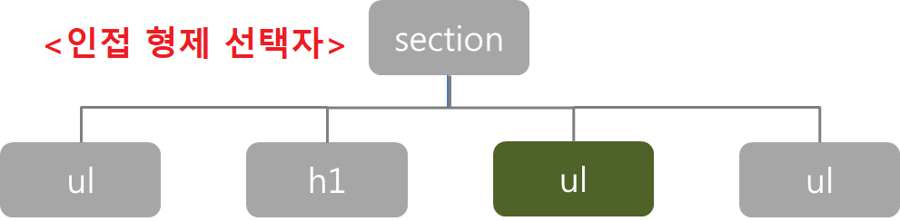
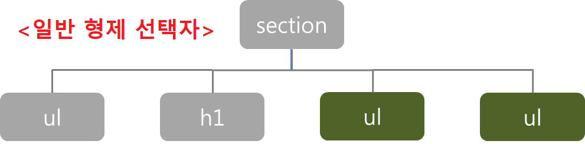

# 선택자

[참고](https://blog.naver.com/tjddjs90/221888798970)

※주의사항 !!!!  
p태그 안에서 div태그 사용시 style 사용이 안되는 (버그)? 가 있습니다.
2020-04-30

---

※주의사항 !!!!  
본인이 원하는 뜻대로의 선택이 안 될 수가 있습니다.
그 이유는 부모에게 준 style이 자식에게 상속 됩니다.!!
그러므로 자식이 다른 style 값이 없으면, 부모의 style 값을 상속 받게 됩니다!!!!!

---

## 전체 선택자(Universal Selector)

| 패턴 | 의미                                      |
| ---- | :---------------------------------------- |
| \*   | HTML페이지 내부의 모든 태그를 선택합니다. |

```
* { margin: 0; text-decoration: none; }
```

---

## 태그 선택자(Type Selector)

| 패턴 | 의미                                 |
| ---- | :----------------------------------- |
| E    | 태그명이 E인 특정 태그를 선택합니다. |

```
/* CSS */
p { background: yellowgreen; color: darkgreen; }

<!-- HTML -->
<p>태그 선택자(Type Selector)</p>
<div>태그 선택자(Type Selector)</div>
```

---

## 클래스 선택자(Class Selector)

| 패턴     | 의미                                                  |
| -------- | :---------------------------------------------------- |
| .myClass | 클래스 속성값이 myClass으로 지정된 요소를 선택합니다. |

```
/* CSS */
.class1 { background: yellowgreen; color: darkgreen; }
div.class2 { background: darkgreen; color: yellowgreen; }

<!-- HTML -->
<p class="class1">클래스 선택자(Class Selector)</p>
<p class="class2">클래스 선택자(Class Selector)</p>
<div class="class2">클래스 선택자(Class Selector)</div>
```

---

## ID 선택자(ID Selector)

| 패턴  | 의미                                         |
| ----- | :------------------------------------------- |
| #myId | id 속성값이 myId로 지정된 요소를 선택합니다. |

```
/* CSS */
#id1 { background: yellowgreen; color: darkgreen; }
div#id2 { background: darkgreen; color: yellowgreen; }

<!-- HTML -->
<p id="id1">ID 선택자(ID Selector)</p>
<p id="id2">ID 선택자(ID Selector)</p>
<div id="id2">ID 선택자(ID Selector)</div>
```

---

## 복합 선택자(Combinator)

### 하위 선택자(Descendant Combinator)와 자식 선택자(Child Combinator)

| 패턴 | 의미                                 |
| ---- | :----------------------------------- |
| E F  | E 요소의 자손인 F 요소를 선택합니다. |
| E>F  | E 요소의 자식인 F 요소를 선택합니다. |

```
/* CSS */
/* 하위 선택자 */
section ul { border: 1px dotted black; }

/* 자식 선택자 */
section>ul { border: 1px dotted black; }
```

자식 선택자는 >(꺽쇠괄호) 로 표현하는 방법이고,
자손(하위) 선택자는 요소와 요소 사이에 띄어쓰기 space 로 구분 해줍니다.



### 인접 형제 선택자(Adjacent Sibling Combinator)와 일반 형제 선택자(General Sibling Combinator)

| 패턴 | 의미                                                                                          |
| ---- | :-------------------------------------------------------------------------------------------- |
| E+F  | E 요소를 뒤따르는 F 요소를 선택합니다. (E와 F 사이에 다른 요소가 존재하면 선택하지 않습니다.) |
| E~F  | E 요소가 앞에 존재하면 F를 선택합니다.(E가 F보다 먼저 등장하지 않으면 선택하지 않습니다.)     |

```
/* CSS */
/* 인접 형제 선택자 */
h1+ul { background: yellowgreen; color: darkgreen; }

/* 일반 형제 선택자 */
h1~ul { background: darkgreen; color: yellowgreen; }
```




---

## 속성 선택자(Attribute Selectors)

| 패턴             | 의미                                                                                           |
| ---------------- | :--------------------------------------------------------------------------------------------- |
| E[attr]          | attr' 속성이 포함된 요소 E를 선택합니다.                                                       |
| E[attr="val"]    | 'attr' 속성의 값이 정확하게 'val'과 일치하는 요소 E를 선택합니다.                              |
| E[attr~="val"]   | 'attr' 속성의 값에 'val'이 포함되는 요소를 선택합니다. (공백으로 분리된 값이 일치해야 합니다.) |
| E[attr^="val"]   | 'attr' 속성의 값이 'val'으로 시작하는 요소를 선택합니다.                                       |
| E[attr$="val"]   | 'attr' 속성의 값이 'val'으로 끝나는 요소를 선택합니다.                                         |
| E[attr*="val"]   | 'attr' 속성의 값에 'val'이 포함되는 요소를 선택합니다.                                         |
| E[attr`|`="val"] | 'attr' 속성의 값이 정확하게 'val' 이거나 `|` 'val-' 으로 시작되는 요소 E를 선택합니다.         |

```
/* CSS */
/* E[attr]형식 */
a[href] { background: yellowgreen; color: black; }

/* E[attr="val"]형식 */
input[type="text"] { width: 150px; border: 1px solid #000; }

/* E[attr$="val"]형식 */
a[href$=".xls"] { background: darkgreen; }

<!-- HTML -->
<a href="one.html">E[attr]형식</a>
<input type="text" name="name">
<a href="one.xls">E[attr$="val"]형식</a>
```

---

출처 : http://www.nextree.co.kr/p8468/
